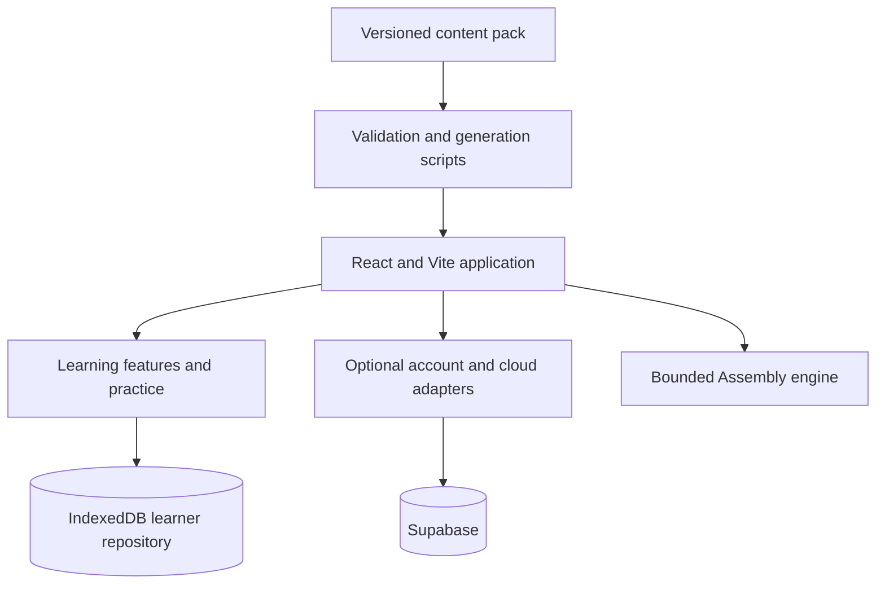
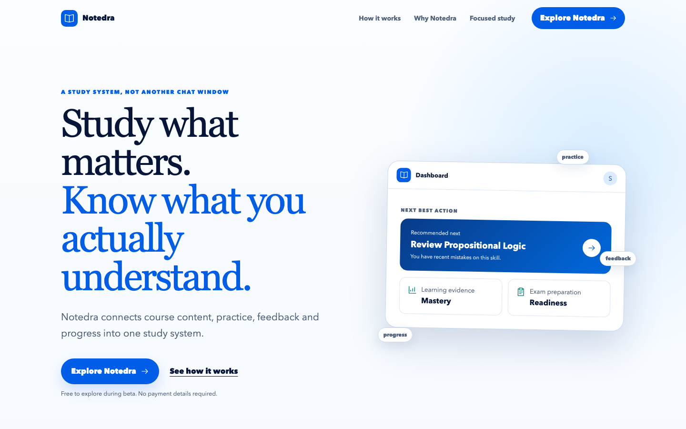
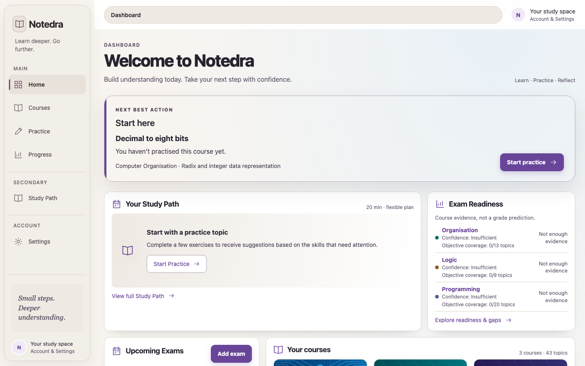
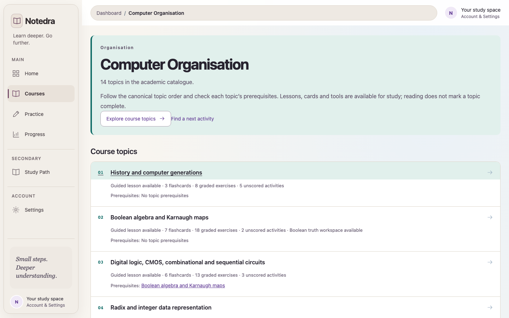
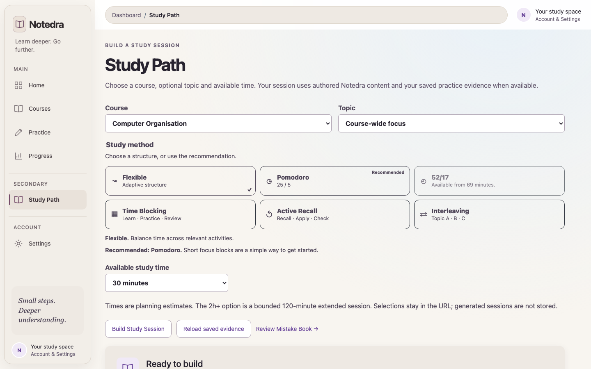
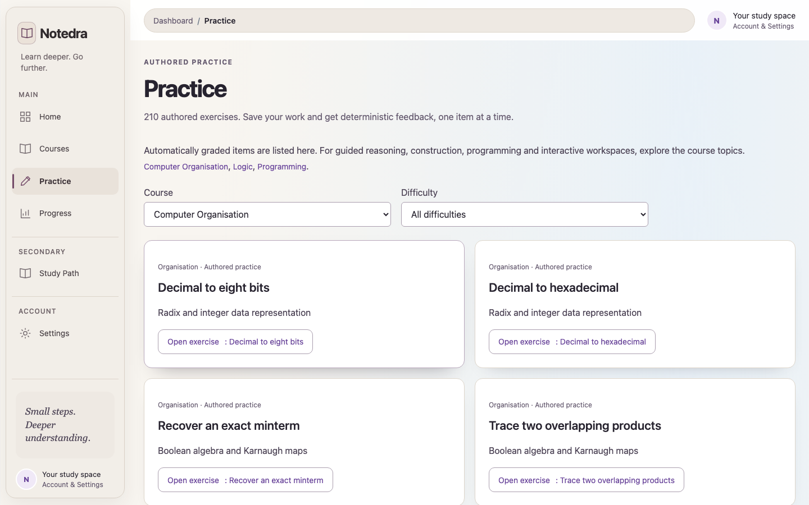
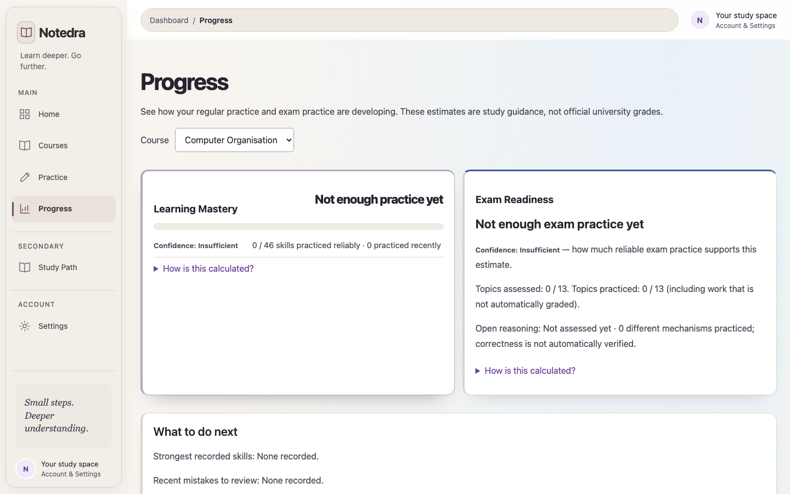
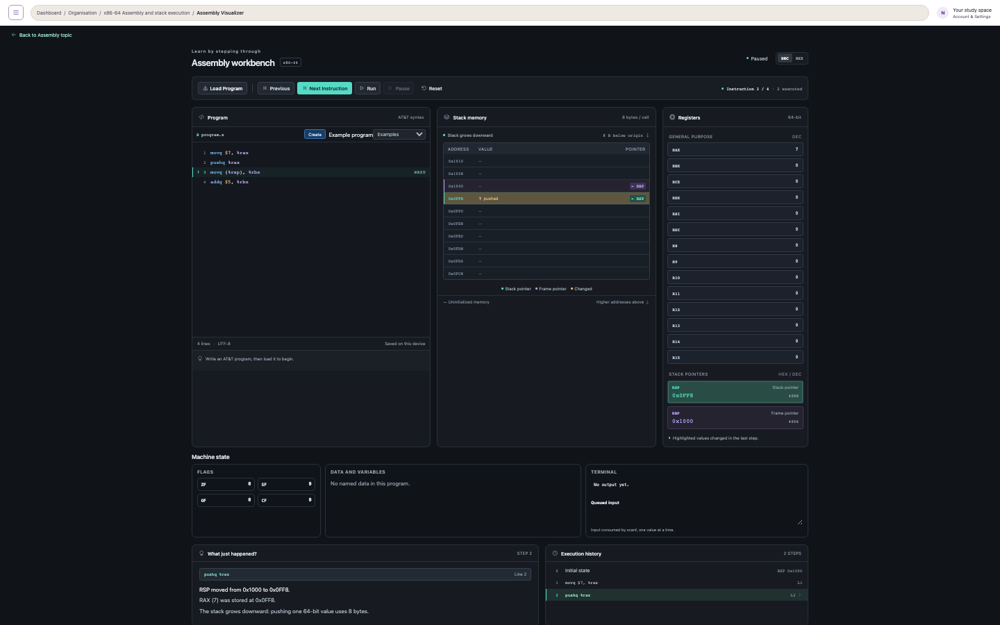
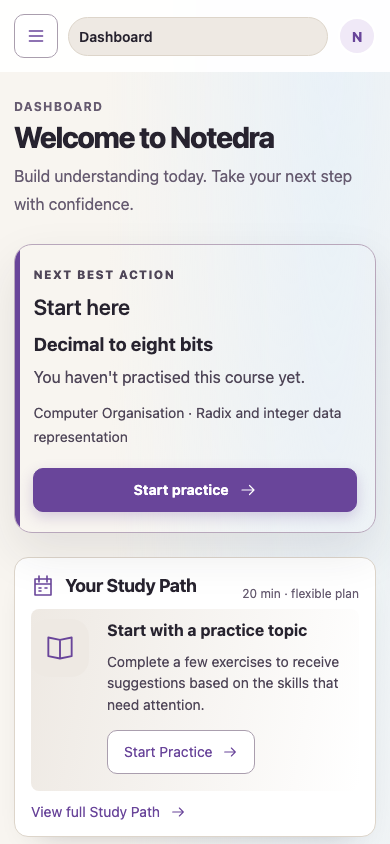

# Notedra

Notedra is a browser-based study workspace for first-year Computer Science and Engineering topics. It combines structured learning content, deterministic practice, progress review and an interactive x86-64 Assembly Visualizer.

It brings course explanations, practice and revision evidence into one workspace, helping students move from reading a topic to practising it and reviewing mistakes.

The project is an independent educational platform and is not an official service of any university.

## Why I built it

Notedra started as a focused way to turn first-year Computer Science material into an active study workflow. It evolved from course navigation into a tested learning workspace with deterministic practice, local evidence, adaptive review and a bounded Assembly teaching tool. Building it has been an exercise in content integrity, stateful browser storage, safe optional synchronisation and designing educational feedback that stays transparent about its limits.

## Current features

- Course navigation and topic-based learning views.
- Computer Organisation content with registers, memory, stack and function-call visualisations.
- Logic learning material, guided practice and bounded workspaces.
- Programming content with Java-oriented guided exercises and a coding workbench.
- Flashcards, authored practice and deterministic feedback.
- Mock exams with timed sessions, autosave and review.
- Local learner data with backups, mistake review, study-path suggestions and progress/readiness summaries.
- Optional email accounts and learner-state synchronisation through Supabase.

The Assembly engine is intentionally limited and deterministic. Learner Java is not executed or automatically graded.

## Engineering highlights

- Deterministic simulation and feedback with explicit limits on supported operations.
- Transactional IndexedDB storage, versioned learner data and backup validation.
- Optional cloud synchronisation with explicit conflict handling and local fallback.
- Validated academic content and generated projections checked against preservation baselines.
- Strict TypeScript and automated regression tests; see [CI](#continuous-integration) for the verification scope.

## Technology

- React 19 and React Router
- TypeScript
- Vite
- Tailwind CSS
- Vitest and jsdom
- Supabase JavaScript client for optional account/cloud-sync features
- pnpm for reproducible dependency installation

## Architecture

React routes and the application shell compose the course modules and learning tools. Practice and exam results feed the local learner repository; adaptive review and progress derive summaries from that evidence. The Assembly engine is a separate deterministic TypeScript module. Optional account and cloud adapters connect learner state to Supabase.

```text
Versioned content pack → validation / generation → course views and practice
React routes → learning services → IndexedDB learner repository
                              ↘ optional cloud adapters → Supabase
Assembly workbench → bounded simulation engine
```

See the [architecture guide](docs/architecture.md) for code entry points and boundaries.



The cloud branch is optional; local learning remains available without Supabase.

## Project structure

```text
src/           Application, learning features, course modules and Assembly engine
tests/         Unit, integration and browser-oriented validation tests
scripts/       Content validation, generation, build and release checks
content-pack/  Versioned academic source material and validation metadata
docs/          Acceptance reports, inventories and implementation documentation
supabase/      Database migrations and Supabase-related project files
hosting/       Hosting handler and policy files
public/        Static public assets
.github/       CI workflow and contribution templates
```

The main runtime code lives in `src/`. Content projections in `src/generated/` are generated by the repository scripts and are committed when required by the content checks.

## Local setup

Requirements:

- Node.js 22.13 or newer
- pnpm 10 (matching CI)

Clone the repository with full history, using an account with access:

```bash
git clone https://github.com/mattiamelli/DelftStudy.git
cd DelftStudy
```

Avoid ZIP downloads and shallow clones: preservation checks read pinned historical Git objects.

Install dependencies:

```bash
pnpm install --frozen-lockfile
```

For the local-only experience, no environment variables are required. To enable the optional account and cloud-sync features:

```bash
cp .env.example .env.local
```

Set these variables in `.env.local`:

```text
VITE_SUPABASE_URL=
VITE_SUPABASE_PUBLISHABLE_KEY=
```

Use only the browser-safe publishable key. Never place a Supabase service-role key, database password or other administrative secret in a Vite environment variable or in this repository. Supabase migrations are not applied automatically by the local setup instructions.

Start the development server:

```bash
pnpm dev
```

For setup troubleshooting and optional Java verification, see the [setup guide](docs/setup.md).

Vite normally serves the application at `http://127.0.0.1:5173/`.

## Validation and build

```bash
pnpm test
pnpm typecheck
pnpm build
```

The build runs the content, projection, exercise, course and release validation gates before producing the Vite output in `dist/`. Additional focused checks are available in `package.json`, including authentication, synchronisation, content, adaptive-learning, exam and security validation commands.

## Verification snapshot

- 1,927 automated tests pass in GitHub Actions.
- TypeScript typechecking runs as an explicit CI gate and again during the production build.
- CI installs from the frozen pnpm lockfile and builds the production bundle on every push and pull request to `main`.
- The repository intentionally does not claim a coverage percentage or live Supabase acceptance without a measured run.

## Project preview

These current production views show the complete Notedra study workflow using a clean anonymous local profile.

### 1. Landing

The public product story connects course material, authored practice, feedback, progress and exam preparation.



### 2. Dashboard

The dashboard opens with one clear next action, followed by Study Path and honest readiness context.



### 3. Computer Organisation

Subject pages organise canonical topics, prerequisites, lessons, flashcards and practice without exposing internal course identifiers.



### 4. Study Path

Study Path combines course context, available time and six compact study methods with a transparent recommendation.



### 5. Practice

Authored exercises are filterable by subject and difficulty, with deterministic feedback where supported.



### 6. Progress

Mastery and exam readiness remain separate, evidence-based measures and report insufficient evidence honestly.



### 7. Assembly Visualizer

The x86-64 workbench exposes source, registers, flags, stack memory, terminal state and execution history step by step.



### 8. Mobile

The same Next Best Action and study workflow remain clear at a 390 px mobile viewport.



These are real production application views captured from a clean anonymous session. They contain no account data, tokens or administrative panels.

Useful additional commands:

| Command | Purpose |
| --- | --- |
| `pnpm test:watch` | Rerun tests during local development |
| `pnpm preview` | Serve the existing local build |
| `pnpm check:academic` | Check the academic projection without rewriting it |
| `pnpm check:references` | Check generated student references |
| `pnpm check:topics` | Check the topic projection |
| `pnpm validate:security-final` | Check source and built assets after a build |

## Continuous integration

[GitHub Actions](.github/workflows/ci.yml) runs one verification job on pushes and pull requests to `main`: pnpm 10, Node.js 22, a frozen-lockfile install, typecheck, tests and build. The workflow has read-only repository permissions and does not deploy or apply database migrations.

The full Git checkout (`fetch-depth: 0`) is intentional: hardening checks compare protected files with a pinned historical baseline. The build repeats typechecking so standalone builds retain that safeguard; the separate CI step gives a clear early failure.

Vitest covers engine logic, content contracts, storage, practice, exams and cloud behaviour, including DOM and fake-storage tests. Passing these checks does not establish current live Supabase, cross-browser or production acceptance. Historical acceptance evidence is indexed in [docs/README.md](docs/README.md).

## Academic content

The versioned source of truth is the DelftStudy Content Pack in `content-pack/v1.0.1/`. Its schemas, checksums, provenance rules and uncertainty policies are documented in that directory and in the related files under `docs/`.

The repository deliberately does not ship the original lecture PDFs or full PDF text. Validation and generated projections must remain consistent with the audited content pack.

## Security and privacy

- `.env`, `.env.*`, local environment files, certificates, private keys and common local configuration files are ignored.
- Only the publishable Supabase client configuration belongs in local frontend variables.
- Learner data is local by default. Optional synchronisation is limited to the records documented by the account/cloud-sync documentation.
- Do not commit credentials, access tokens, service-role keys, database connection strings or personal data.
- If a secret is ever committed, revoke or rotate it immediately and investigate the complete Git history before publishing the repository.

## Project status

Notedra is an active student project. The current codebase contains the implemented learning, practice, progress, exam, optional account/sync and Assembly features described above. Some validation reports in `docs/` record historical release checkpoints and should be read with their stated scope and limitations.

Known limitations include:

- The Assembly Visualizer supports a bounded educational subset of x86-64 rather than a complete assembler or CPU emulator.
- Learner Java drafts are not executed or automatically graded.
- Progress and readiness values are transparent project heuristics, not official grades or validated exam predictions.
- Live Supabase/RLS and multi-device acceptance require an explicitly configured test environment.
- Browser compatibility and acceptance coverage are documented in the relevant reports under `docs/`.

## Roadmap

Planned work may include broader Assembly control-flow support, a richer memory inspector, more learning content, additional practice coverage, shareable programs and further study-planning capabilities. Roadmap items are not commitments and are not necessarily implemented in the current version.

## Contributing

This repository currently serves as a personal academic and portfolio project. Changes should preserve the deterministic content contracts, existing learner-data migrations and the documented security boundaries. Run the test, typecheck and build commands before opening a pull request. See [CONTRIBUTING.md](CONTRIBUTING.md) for the workflow and commit conventions, and [SECURITY.md](SECURITY.md) for reporting concerns.

## Author

Mattia Melli — Computer Science and Engineering student.
